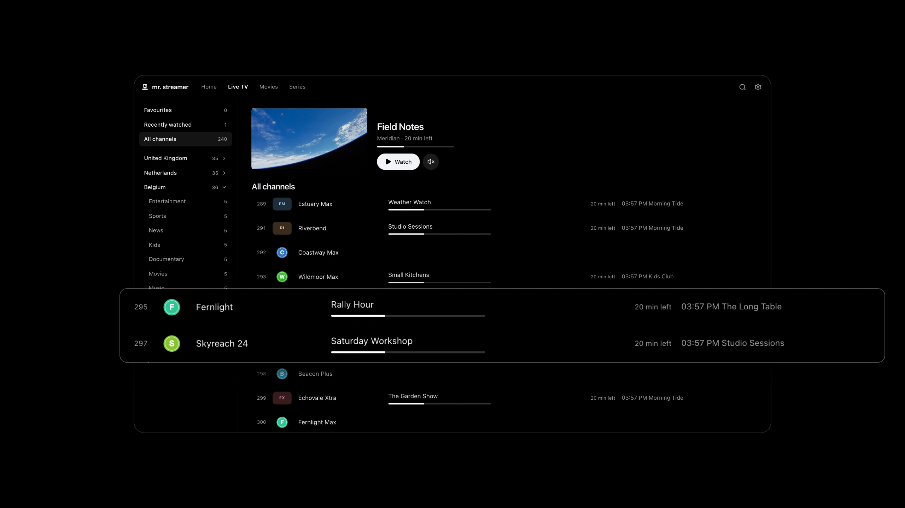
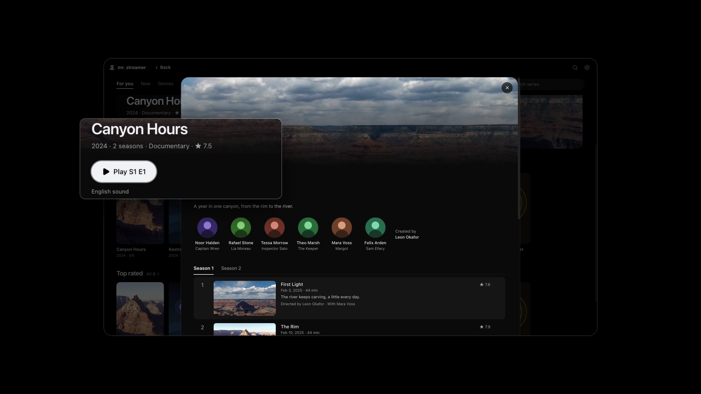
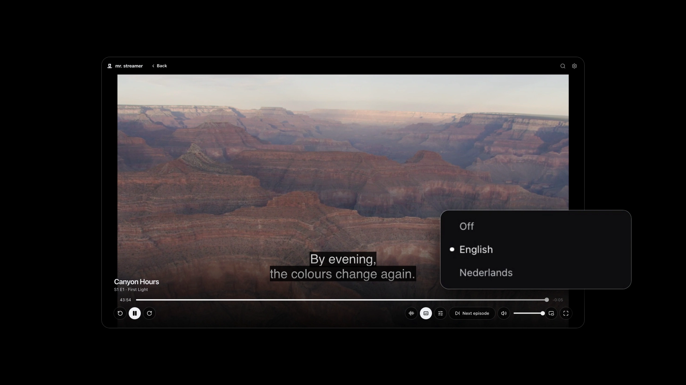

<h1 align="center">Mr. Streamer</h1>

<strong>Live TV, movies and series. One place.</strong> A desktop player for the IPTV subscription you already have.

  <a href="https://apps.microsoft.com/detail/9N45GG76ZP4T?referrer=appbadge">
    <picture>
      <source media="(prefers-color-scheme: dark)" srcset="https://get.microsoft.com/images/en-us%20light.svg">
      
    </picture>
  </a>

<strong><a href="https://github.com/Mr-Streamer-OSS/MrStreamer/releases/latest">Download for macOS, Windows or Linux</a></strong>

### Every channel. What's on now, what's next.

A programme guide, favourites, and the channels you watched last.

### Your films and series, in your language.

Stories, artwork and cast, with resume and the next episode.

### Every sound track. Every subtitle.

Every track your provider sends, on live channels and on demand.

The pictures come from a test provider with made-up titles and public-domain footage.

## What you need

An IPTV subscription with Xtream Codes access: a server address, username and password, or an M3U link that contains them. An M3U playlist link without a login brings live TV only.

Mr. Streamer supplies no channels, playlists or subscriptions. It has no ads, your login and what you watched stay on your computer, and it's free and open source.

<strong>Install notes</strong>

On Windows, the [Microsoft Store](https://apps.microsoft.com/detail/9N45GG76ZP4T?referrer=appbadge) installs Mr. Streamer and keeps it updated. Every other installer is on the [Releases page](https://github.com/Mr-Streamer-OSS/MrStreamer/releases/latest).

| System                              | File                                          |
| ----------------------------------- | --------------------------------------------- |
| macOS 13 or later, Apple silicon    | `Mr-Streamer-<version>-mac-arm64.dmg`         |
| Windows 11, 64-bit                  | `Mr-Streamer-<version>-win-x64-setup.exe`     |
| Linux, 64-bit (Ubuntu, Debian)      | `Mr-Streamer-<version>-linux-amd64.deb`       |
| Linux, 64-bit (other distributions) | `Mr-Streamer-<version>-linux-x86_64.AppImage` |

**macOS:** open the DMG and drag Mr. Streamer to Applications.

**Windows:** without the Store, run the setup file. It installs for your user account, without administrator rights. The installer isn't signed yet, so SmartScreen may warn that the app is unrecognised: choose **More info**, then **Run anyway**.

**Linux:** install the deb with `sudo apt install ./Mr-Streamer-<version>-linux-amd64.deb`. The AppImage runs without installing: make it executable (`chmod +x`) and open it. AppImages need FUSE 2; on Ubuntu, `sudo apt install libfuse2t64` provides it.

<strong>First steps</strong>

1. Enter your provider's server address, username and password, or paste the M3U link your provider sent. Mr. Streamer checks the login and loads your channels; movies and series follow. A playlist link without a login loads its channels only. An address without `http://` or `https://` connects encrypted when the server allows it; otherwise Mr. Streamer asks before sending your login unencrypted.
2. **Live TV** lists every channel with what's on now and next. Click one to watch; the list opens over the picture to switch.
3. **Movies** and **Series** open on For you. A poster opens its details; **Play** or **Resume** starts it.
4. In Settings (⌘, or Ctrl ,), **General** sets the languages for titles, sound and subtitles, and your update channel; **Subscription** shows your account and refreshes its lists.

Mr. Streamer looks for updates after it starts and every four hours. When one is ready, **Update** appears in the top bar: download it, then restart when it suits you. **Stable** gets tested releases, **Nightly** the newest builds.

<strong>Limits</strong>

- One subscription at a time: Xtream Codes access, or an M3U playlist for live TV.
- No recording, downloads or casting to a TV.
- Surround sound that needs converting plays as stereo, and converting a picture uses much more of your computer's processor than playing it as it is.
- Choosing another sound track on a live channel starts the channel again for a moment.
- The Windows installer isn't signed yet; the Microsoft Store version is.

[What plays](docs/user/playback.md#known-limits) lists the formats and every known limit.

## Help

[Live TV](docs/user/live-tv.md) · [Movies and series](docs/user/movies-and-series.md) · [Updates and channels](docs/user/updates.md) · [What plays](docs/user/playback.md) · [Troubleshooting](docs/user/troubleshooting.md) · [Privacy](docs/privacy.md)

Found a bug? [Report it](https://github.com/Mr-Streamer-OSS/MrStreamer/issues/new/choose) with your system, the Mr. Streamer version from Settings > About, and what happened.

## Contributing

Mr. Streamer is open source and under active development. For now it accepts small bug fixes: [CONTRIBUTING.md](CONTRIBUTING.md) explains how to report a bug, run the app and send a fix.

## License

GPL-3.0. See [LICENSE](LICENSE). Installers include FFmpeg and x264, also under the GPL; their exact sources are attached to every release. Settings > About > Open-source licences lists every component the app ships, with its licence.

Movie and series details come from [TMDB](https://www.themoviedb.org). This application uses TMDB and the TMDB APIs but is not endorsed, certified, or otherwise approved by TMDB. Where titles stream comes from [JustWatch](https://www.justwatch.com).

Store screenshots and the trailer include Big Buck Bunny (c) copyright 2008, Blender Foundation, [www.bigbuckbunny.org](https://www.bigbuckbunny.org), [CC BY 3.0](https://creativecommons.org/licenses/by/3.0/): excerpts, renamed and subtitled in the demo. Earth views: NASA. Grand Canyon footage: U.S. National Park Service.
