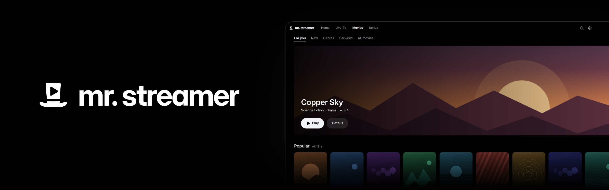

# Mr. Streamer

A desktop player for the IPTV subscription you already have. Connect it once, then watch its live channels with a programme guide, and its movies and series with resume and the next episode. Your login, lists and what you watched stay on your computer.

Mr. Streamer works with providers that offer Xtream Codes access (a server address, username and password, or an M3U link that contains them).

## Download

Get the latest release from the [Releases page](https://github.com/Mr-Streamer-OSS/MrStreamer/releases/latest).

| System                              | File                                          |
| ----------------------------------- | --------------------------------------------- |
| macOS 13 or later, Apple silicon    | `Mr-Streamer-<version>-mac-arm64.dmg`         |
| Windows 11, 64-bit                  | `Mr-Streamer-<version>-win-x64-setup.exe`     |
| Linux, 64-bit (Ubuntu, Debian)      | `Mr-Streamer-<version>-linux-amd64.deb`       |
| Linux, 64-bit (other distributions) | `Mr-Streamer-<version>-linux-x86_64.AppImage` |

## Install

**macOS:** open the DMG and drag Mr. Streamer to Applications. Open it from Applications.

**Windows:** run the setup file. It installs for your user account only, without asking for administrator rights. Windows SmartScreen may warn that the app is unrecognised, because the installer isn't signed yet: choose **More info**, then **Run anyway**.

**Linux:** install the deb with `sudo apt install ./Mr-Streamer-<version>-linux-amd64.deb`, then start Mr. Streamer from your applications menu. The AppImage runs without installing: make it executable (`chmod +x`) and open it. AppImages need FUSE 2; on Ubuntu, `sudo apt install libfuse2t64` provides it.

## Use

1. Enter your provider's server address, username and password, or paste the M3U link your provider sent. Mr. Streamer checks the login and loads your channels.
2. **Home** plays your last channel, muted, with what's on now, then what you were watching, your favourites, new movies and new series.
3. **Live TV** lists every channel with what's on now and next, by favourites, country and category. [Live TV](docs/user/live-tv.md) covers the guide and its keys.
4. **Movies** and **Series** list what your provider offers on demand, in tabs: For you, New, genres, streaming services and everything. **Resume** carries on where you stopped, **Sound** and **CC** pick the tracks, and a series offers its next episode. See [Movies and series](docs/user/movies-and-series.md).
5. ⌘K (Ctrl K on Windows and Linux) searches channels, programmes, movies and series.

Settings (⌘, or Ctrl ,) has the languages for titles, sound and subtitles, and updates, under General; your subscription; and the open-source licences under About.

## Updates

Mr. Streamer checks for updates after it starts and every four hours. A quiet **Update** appears in the top bar: download it when you like, and restart when it suits you. It never restarts on its own, so nothing interrupts what you're watching.

There are two channels: **Stable** for tested releases, and **Nightly** for the newest builds. Installing a newer version by hand from the Releases page also keeps your data. [Updates and channels](docs/user/updates.md) covers switching channels.

## Help

- [Live TV](docs/user/live-tv.md): Home, the guide, favourites, search and keys
- [Movies and series](docs/user/movies-and-series.md): browsing, resume, tracks and the next episode
- [Updates and channels](docs/user/updates.md)
- [What plays](docs/user/playback.md), including formats that are converted and known limits
- [Troubleshooting](docs/user/troubleshooting.md): login and keychain, installation warnings, where your data is stored

Found a bug? [Report it](https://github.com/Mr-Streamer-OSS/MrStreamer/issues/new/choose) with your system, the Mr. Streamer version from Settings, and what happened.

## Development

Mr. Streamer is open source and under active development. Contributions are limited to small bug fixes for now; see [CONTRIBUTING.md](CONTRIBUTING.md). Building, testing and releasing are covered in the [docs](docs/README.md#working-on-mr-streamer).

## License

GPL-3.0. See [LICENSE](LICENSE). Installers include FFmpeg and x264, also under the GPL; their exact sources are attached to every release. Settings > About > Open-source licences lists every component the app ships, with its licence.

Movie and series details come from [TMDB](https://www.themoviedb.org). This application uses TMDB and the TMDB APIs but is not endorsed, certified, or otherwise approved by TMDB. Where titles stream comes from [JustWatch](https://www.justwatch.com).
