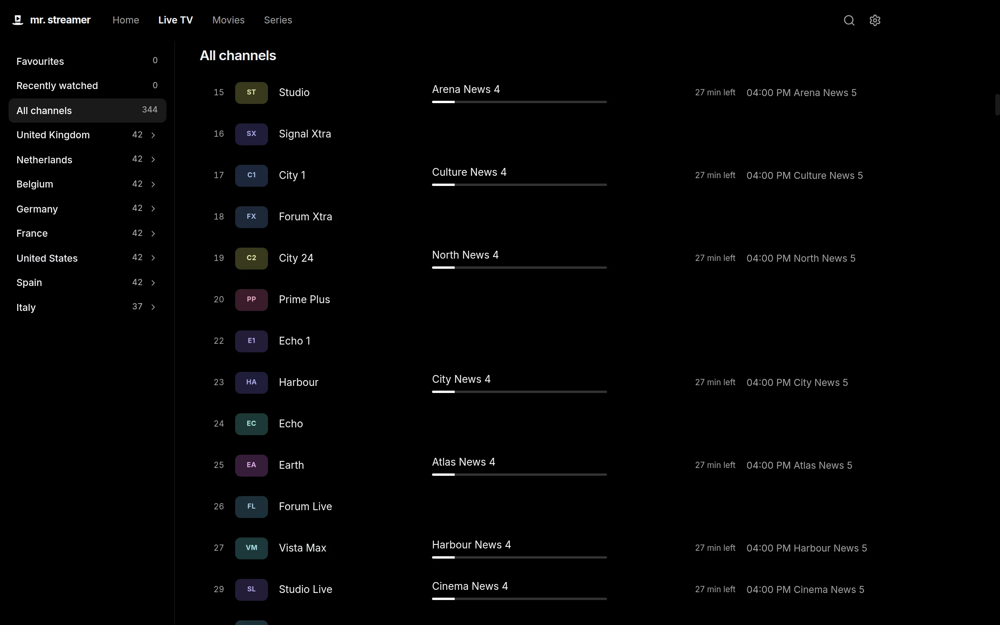
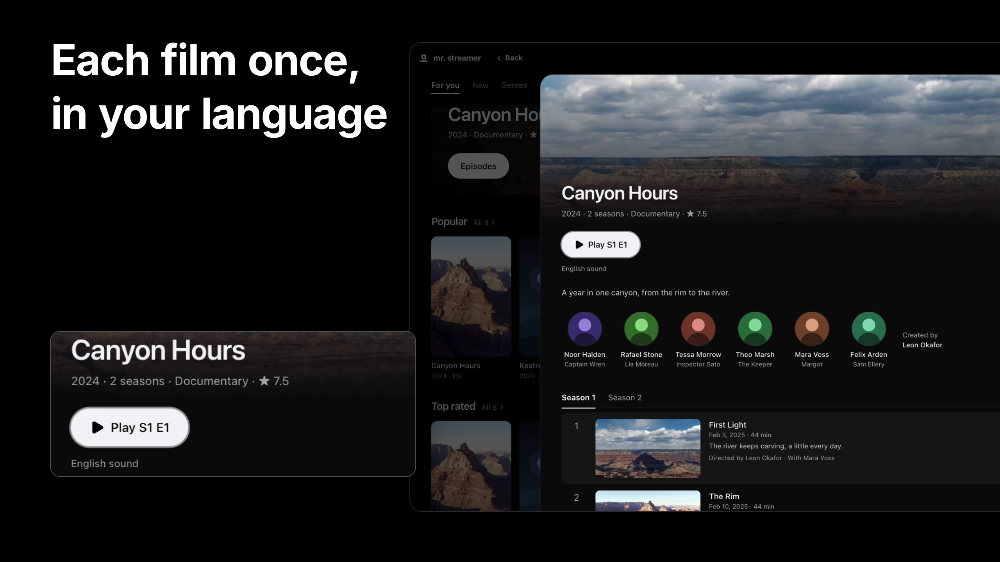
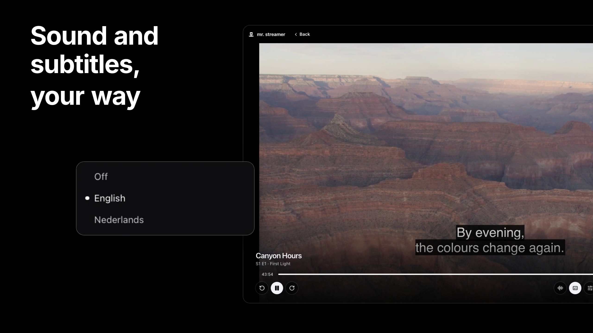

# Mr. Streamer

**A desktop player for the IPTV subscription you already have.** For macOS, Windows and Linux.

Connect it once, then watch its live channels with a programme guide, and its movies and series with resume and the next episode, in the languages you choose. Your login, lists and what you watched stay on your computer.

Mr. Streamer works with providers that offer Xtream Codes access: a server address, username and password, or an M3U link that contains them. An M3U playlist link without a login brings live TV only.

## Download

Get the latest release from the [Releases page](https://github.com/Mr-Streamer-OSS/MrStreamer/releases/latest).

| System                              | File                                          |
| ----------------------------------- | --------------------------------------------- |
| macOS 13 or later, Apple silicon    | `Mr-Streamer-<version>-mac-arm64.dmg`         |
| Windows 11, 64-bit                  | `Mr-Streamer-<version>-win-x64-setup.exe`     |
| Linux, 64-bit (Ubuntu, Debian)      | `Mr-Streamer-<version>-linux-amd64.deb`       |
| Linux, 64-bit (other distributions) | `Mr-Streamer-<version>-linux-x86_64.AppImage` |

**macOS:** open the DMG and drag Mr. Streamer to Applications.

**Windows:** run the setup file. It installs for your user account, without administrator rights. The installer isn't signed yet, so SmartScreen may warn that the app is unrecognised: choose **More info**, then **Run anyway**.

**Linux:** install the deb with `sudo apt install ./Mr-Streamer-<version>-linux-amd64.deb`. The AppImage runs without installing: make it executable (`chmod +x`) and open it. AppImages need FUSE 2; on Ubuntu, `sudo apt install libfuse2t64` provides it.

## What it does

<table>
  <tr>
    <td width="33%"></td>
    <td width="33%"></td>
    <td width="33%"></td>
  </tr>
  <tr>
    <td>Every channel, with what's on now and next</td>
    <td>Each film once, in your language, with its other versions</td>
    <td>Sound and subtitles in the language you choose</td>
  </tr>
</table>

- **Live TV** with a programme guide, favourites and the channels you watched last. Home plays your last channel, muted, behind what's on.
- **Movies and series** in tabs: for you, new, genres, streaming services and everything, with names, stories, artwork and cast from TMDB. Each film shows once, in the version that suits your language; the arrow beside Play picks another.
- **Resume** wherever you stopped, and the next episode when you want it.
- **Sound and subtitles** on live channels and on demand: text subtitles, subtitles stored as pictures (Blu-ray, DVD, DVB), teletext and closed captions.
- **Search** everything with ⌘K (Ctrl K on Windows and Linux), or just movies or series from their own tabs.
- **Updates** you choose when to install, so nothing interrupts what you're watching.

The pictures above come from a test provider with made-up titles and artwork.

## Getting started

1. Enter your provider's server address, username and password, or paste the M3U link your provider sent. Mr. Streamer checks the login and loads your channels; movies and series follow. A playlist link without a login loads its channels only. An address without `http://` or `https://` connects encrypted when the server allows it; otherwise Mr. Streamer asks before sending your login unencrypted.
2. **Live TV** lists every channel with what's on now and next. Click one to watch; the list opens over the picture to switch.
3. **Movies** and **Series** open on For you. A poster opens its details; **Play** or **Resume** starts it.
4. In Settings (⌘, or Ctrl ,), **General** sets the languages for titles, sound and subtitles, and your update channel; **Subscription** shows your account and refreshes its lists.

Mr. Streamer looks for updates after it starts and every four hours. When one is ready, **Update** appears in the top bar: download it, then restart when it suits you. **Stable** gets tested releases, **Nightly** the newest builds.

## Limits

- One subscription at a time: Xtream Codes access, or an M3U playlist for live TV.
- No recording, downloads or casting to a TV.
- Surround sound that needs converting plays as stereo, and converting a picture uses much more of your computer's processor than playing it as it is.
- Choosing another sound track on a live channel starts the channel again for a moment.
- The Windows installer isn't signed yet.

[What plays](docs/user/playback.md#known-limits) lists the formats and every known limit.

## Help

- [Live TV](docs/user/live-tv.md): Home, the guide, favourites, sound and subtitles, search and keys
- [Movies and series](docs/user/movies-and-series.md): browsing, versions, languages, resume and the next episode
- [Updates and channels](docs/user/updates.md)
- [What plays](docs/user/playback.md): formats, what gets converted, and known limits
- [Troubleshooting](docs/user/troubleshooting.md): login and keychain, installation warnings, where your data is stored

Found a bug? [Report it](https://github.com/Mr-Streamer-OSS/MrStreamer/issues/new/choose) with your system, the Mr. Streamer version from Settings > About, and what happened.

## Contributing

Mr. Streamer is open source and under active development. For now it accepts small bug fixes: [CONTRIBUTING.md](CONTRIBUTING.md) explains how to report a bug, run the app and send a fix.

## License

GPL-3.0. See [LICENSE](LICENSE). Installers include FFmpeg and x264, also under the GPL; their exact sources are attached to every release. Settings > About > Open-source licences lists every component the app ships, with its licence.

Movie and series details come from [TMDB](https://www.themoviedb.org). This application uses TMDB and the TMDB APIs but is not endorsed, certified, or otherwise approved by TMDB. Where titles stream comes from [JustWatch](https://www.justwatch.com).
